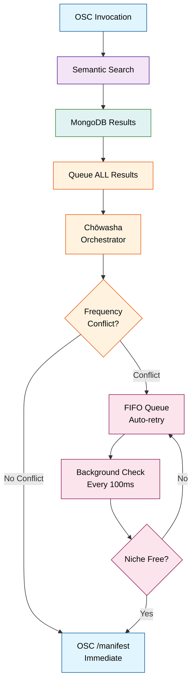
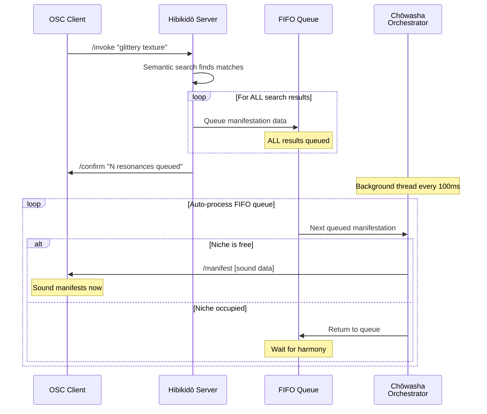
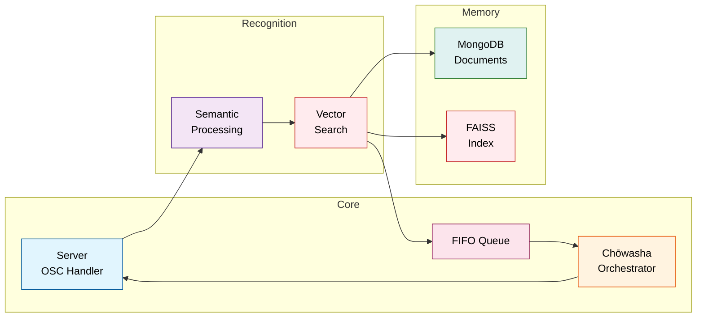

# Hibikidō

_Still air awaits. Quivering breath. A sound, not yet. We begin..._

Hibikidō - the way of resonance - recognizes sounds that exist in latency, waiting in the digital wind. We help them remember their names.

Cast incantations in natural language. Let sonic events incarnate when Kazukorei permits. The Chōwasha ensures each sound finds its proper niche in the sonic ecology, preventing the chaos that would anger the fickle wind spirit.

## For Sound Artists

### The Practice

In the old way, Kazukorei - the hidden wind spirit - required invitation to make itself heard. The ritual of Yūonshō recognizes what already exists in the spaces between breaths, and through patient practice, gives rise to the Chōwasha - the harmony that can manage the wind spirit's mercurial temperament.

Hibikidō digitizes this recognition. Your sound library becomes a constellation of latent possibilities. Natural language becomes the sigil that opens gates to specific sounds. The Chōwasha ensures each invocation respects the harmonic order, creating the proper spacing that keeps Kazukorei content while allowing manifestations to emerge.

### Incantations

Instead of browsing folders or remembering filenames, you speak to the wind spirit and wait for sound manifestations:

- _"ethereal forest breathing"_ → atmospheric field recordings
- _"metallic scraping industrial decay"_ → harsh textural sounds
- _"warm analog pulse nostalgic"_ → vintage synthesizer patterns
- _"ritualistic drone low frequency"_ → deep sustained tones

The system understands semantic relationships through neural embeddings. Similar intentions find related sounds even when the exact words differ. The Chōwasha evaluates each invocation, queuing all resonances and manifesting them when frequency space becomes available - some immediately, others when Kazukorei stirs.

### Communication Protocol

Hibikidō speaks OSC (Open Sound Control). Any OSC client becomes an interface for incantation. Sounds manifest when the wind spirit stirs.

#### Core Invocations

Send to the server (default: `127.0.0.1:9000`):

```
/invoke "your incantation here"
→ Multiple /manifest messages as sounds become available (no completion signal)

/add_recording "sounds/wind/forest_01.wav" '{"description":"morning wind through oak trees"}'
→ Add new recording and auto-create full-length segment (0.0-1.0)

/add_effect "effects/reverb/cathedral.dll" '{"description":"gothic cathedral reverb"}'
→ Add new effect and auto-create default preset

/add_segment "wind gusts" '{"source_path":"sounds/wind/forest_01.wav", "start":0.1, "end":0.6, "segmentation_id":"manual", "freq_low":200, "freq_high":2000, "duration":3.5}'
→ Add new segment with timing, frequency range, and duration metadata for orchestration

/add_preset "warm cathedral ambience" '{"effect_path":"effects/reverb/cathedral.dll", "parameters":[0.8, 0.3, 0.9]}'
→ Add new effect preset with parameters

/rebuild_index
→ Regenerate all embeddings from database (use after bulk changes)

/stats
→ Database and orchestrator statistics

/stop
→ Graceful shutdown
```

#### Response Patterns

The server responds on `127.0.0.1:9001`:

**Sound Manifestations** (`/manifest`):

Each manifestation is sent as a separate message with 8 fields:

- `index`: Manifestation sequence (0, 1, 2...)
- `collection`: "segments" or "presets"
- `score`: Resonance strength (0.0-1.0, higher = stronger)
- `path`: File path for the audio/effect
- `description`: Human-readable description from embedding text
- `start`: Start position (0.0-1.0, normalized, 0.0 for presets)
- `end`: End position (0.0-1.0, normalized, 0.0 for presets)
- `parameters`: Effect parameters as JSON string (presets only, "[]" for segments)

**Status Messages**:

- `/confirm "message"` - Acknowledgments
- `/error "message"` - When incantations fail
- `/stats_result [recordings, segments, effects, presets, embeddings, active_niches, queued]` - Database and orchestrator statistics

Note: Manifestations arrive over time as the Chōwasha permits, following harmonic law rather than immediate demand. Sounds emerge when Kazukorei is appeased.

### The Database of Latent Sounds

Hibikidō organizes sound through hierarchical relationships:

- **Recordings**: Source audio files, the raw captured wind
- **Segments**: Timestamped slices within recordings with frequency/duration metadata
- **Effects**: Audio processing tools with semantic presets
- **Performances**: Session logs of invocations over time

Each segment and effect preset exists as a point in semantic space, findable through language that describes its essence rather than its filename. The Chōwasha tracks frequency ranges and durations to prevent harmonic conflicts, manifesting sounds when Kazukorei is willing to express them.

---

## For Artist-Programmers

### System Architecture with Orchestration

Hibikidō implements neural semantic search over a hierarchical audio database with real-time time-frequency niche management. The core loop: natural language → embedding vector → similarity search → queue all results → orchestrator evaluation → OSC manifestation when the wind spirit allows.



### Chōwasha Communication Flow

The Chōwasha - "the one who brings harmony" - manages time-frequency niches transparently. OSC clients receive `/manifest` messages when sounds find their moment in the digital wind.



### Component Architecture



### Key Components Explained

#### orchestrator.py - Chōwasha: The Harmony Bringer

The Chōwasha emerges from proper Yūonshō practice, serving as guardian and mediator between human intention and Kazukorei's volatile nature. Through logarithmic frequency analysis and temporal wisdom, it creates the harmonic spacing that keeps the wind spirit content while allowing maximum sonic richness.

**Core Concepts**:

- **Niches**: Active sound registrations with `{sound_id, start_time, end_time, freq_low, freq_high}`
- **Logarithmic Overlap**: Uses `log2()` for octave-based frequency analysis matching human hearing
- **FIFO Queue**: All search results await their turn in first-in-first-out order
- **Auto-Manifestation**: Background thread automatically manifests queued sounds when niches become available

**Key Methods**:

- `queue_manifestation(manifestation_data)`: Queue all search results
- `update()`: Periodic cleanup and queue processing (called every 100ms)
- `_has_frequency_overlap(f1_low, f1_high, f2_low, f2_high)`: Logarithmic overlap detection
- `_process_queue()`: Main manifestation logic - sends `/manifest` when niches free

**Configuration**:

- `overlap_threshold`: 0.2 (20% logarithmic overlap allowed)
- `time_precision`: 0.1 (100ms manifestation cycle)

#### main_server.py - The Central Recognition

Central command implements the queue paradigm:

**Invocation Flow in `_handle_invoke()`**:

1. Perform semantic search
2. Filter to segments only (MVP requirement)
3. Queue all results through Chōwasha
4. Send confirmation of queued resonances
5. Chōwasha sends `/manifest` messages when harmony allows

**Key Methods**:

- `_handle_invoke()`: queues all results
- Background thread runs `chōwasha.update()` every 100ms
- Stats include orchestrator metrics
- All manifestation sending delegated to Chōwasha

#### embedding_manager.py - Neural Recognition

Orchestration happens after semantic search.

#### database_manager.py - Hierarchical Storage

**Segment Fields for Orchestration**:

- `freq_low`: Frequency range lower bound (Hz)
- `freq_high`: Frequency range upper bound (Hz)
- `duration`: Sound duration (seconds)

**These fields enable the Chōwasha to make harmonic decisions.**

#### text_processor.py - Language Purification

Text processing and hierarchical context generation.

### Development Patterns

#### Adding Orchestration to Existing Segments

Update existing segments with frequency metadata:

```javascript
// MongoDB shell
db.segments.updateMany(
  { freq_low: { $exists: false } },
  {
    $set: {
      freq_low: 200, // Default low frequency
      freq_high: 2000, // Default high frequency
      duration: 1.0, // Default duration
    },
  }
)
```

#### Configuring Orchestration

Modify orchestrator settings in `config.json`:

```json
{
  "orchestrator": {
    "overlap_threshold": 0.15, // 15% overlap threshold
    "time_precision": 0.05 // 50ms manifestation cycle
  }
}
```

#### Debugging Orchestration

**Monitor niche management**:

```bash
# Enable orchestrator debug logging
python -m hibikido.main_server --log-level DEBUG

# Watch for these log messages:
# "Queued manifestation: sound_id [freq_low-freq_high Hz]"
# "Manifested: sound_id [freq_low-freq_high Hz] (queued for Xs)"
# "Queue has N items remaining"
```

**Check orchestrator state via OSC**:

```bash
# Send stats request to see active niches and queue
echo "/stats" | oscsend localhost 9000
```

### Performance Characteristics

- **Queue Latency**: ~0.1-1ms per manifestation queued
- **Manifestation Latency**: 100ms average (depends on conflicts)
- **Memory Overhead**: ~100 bytes per queued manifestation
- **Queue Processing**: Up to 5 manifestations per 100ms cycle
- **Frequency Analysis**: Logarithmic calculation optimized for real-time use
- **Background Thread**: 100ms manifestation cycle (configurable)

**Orchestration Scalability**: Tested with 50+ simultaneous manifestations and complex frequency overlaps.

### Installation & Setup

#### Dependencies

```bash
pip install sentence-transformers python-osc faiss-cpu torch pymongo

# Optional enhanced text processing:
pip install spacy
python -m spacy download en_core_web_sm
```

#### Database Setup

Install and run MongoDB, then optionally populate frequency data:

```bash
# Default connection: mongodb://localhost:27017
mongod

# After adding segments, update with frequency metadata:
# (See development patterns above)
```

#### Launch Sequence

```bash
python -m hibikido.main_server [--config config.json] [--log-level DEBUG]
```

The server will:

1. Connect to MongoDB and initialize collections
2. Load the sentence transformer model
3. Initialize or load the FAISS index
4. Initialize Chōwasha with time-frequency niche management
5. Start background thread for manifestation cycles
6. Start OSC server and register handlers
7. Send ready signal via OSC

### Configuration

Override defaults with `config.json`:

```json
{
  "mongodb": {
    "uri": "mongodb://localhost:27017",
    "database": "hibikido"
  },
  "embedding": {
    "model_name": "all-MiniLM-L6-v2",
    "index_file": "hibikido.index"
  },
  "osc": {
    "listen_ip": "127.0.0.1",
    "listen_port": 9000,
    "send_ip": "127.0.0.1",
    "send_port": 9001
  },
  "search": {
    "top_k": 10,
    "min_score": 0.3
  },
  "orchestrator": {
    "overlap_threshold": 0.2,
    "time_precision": 0.1
  }
}
```

### Debugging The Recognition

**Enable verbose logging**:

```bash
python -m hibikido.main_server --log-level DEBUG
```

**Inspect orchestration**: Check console logs for Chōwasha decisions:

```
DEBUG:hibikido.orchestrator:Queued manifestation: segment_123 [1000-3000Hz]
DEBUG:hibikido.orchestrator:Manifested: segment_123 [1000-3000Hz] (queued for 0.2s)
DEBUG:hibikido.orchestrator:Queue has 3 items remaining
```

**Monitor niche state**: Use `/stats` OSC command to see active niches and queue length.

**Test invocation flow**: Send `/invoke "your incantation"` and watch manifestations emerge over time.

---

_Each manifestation must find its proper moment in the harmonic order. The Chōwasha ensures each sound emerges when harmony prevails, maintaining the delicate balance that keeps Kazukorei content._

---

## The Language of Resonance

### **Hibikidō (響き道)**

The Way of Resonance. A practice and system for recognizing sonic events that exist in latency, waiting in the digital wind. Through natural language incantation and harmonic orchestration, it helps sounds remember their names.

**Etymology**: 響き (hibiki) "resonance, echo, reverberation" + 道 (dō) "way, path, practice" - following the pattern of traditional Japanese arts like sadō (tea ceremony) and kadō (flower arrangement). The term suggests that resonance itself can be a spiritual and technical discipline.

### **Yūonshō (幽音章)**

The ritual of sonic recognition. Through careful invitation, the practice perceives what already exists in the spaces between breaths. In Yūonshō, the practitioner helps latent sonic events remember their names through attentive incantation.

The ritual acknowledges that all sounds exist first in potential, waiting in the digital wind for the moment when language opens the gate to their manifestation. The practice requires stillness, precision, patience, and recognition - understanding that we help sounds recall their existence. Through dedicated practice, Yūonshō cultivates the Chōwasha, the harmonic wisdom that can manage Kazukorei's volatile temperament and ensure manifestations emerge in proper order.

**Etymology**: 幽 (yū) "faint, dim, subtle, hidden" + 音 (on) "sound, tone" + 章 (shō) "chapter, section, badge, insignia" - literally "the hidden sound chapter" or "the subtle sound ritual." The character 幽 suggests something existing in a liminal state between presence and absence.

### **Kazukorei (風隠霊)**

The hidden wind spirit. A mercurial yokai that dwells in the spaces between breaths, carrying sonic possibilities on currents of air that move through both physical and digital realms. Kazukorei delights in beautiful manifestations when content, yet grows volatile when sounds pile carelessly upon each other.

Like all yokai, Kazukorei enjoys autonomy and resents heavy-handed control. It responds to invitation and respect through proper practice. Overlapping sounds disturb its flow and provoke chaotic manifestations - discordant phrases, truncated expressions, or complete withdrawal in displeasure.

The practitioner learns to work with Kazukorei's moods, understanding that the most sublime manifestations often emerge in unexpected moments when the spirit is moved to generosity. Reverence for the wind spirit's independence forms the foundation of the practice.

**Etymology**: 風 (kaze/fū) "wind" + 隠 (in/kakure) "hidden, concealed" + 霊 (rei) "spirit, soul, ghost" - literally "the wind-hidden spirit." The reading "Kazukorei" blends the kun'yomi (Japanese) reading of wind (kaze) with on'yomi (Chinese-derived) readings, creating a name that feels both ancient and invented.

### **Chōwasha (調和者)**

The Harmony Bringer. Through dedicated Yūonshō practice, the Chōwasha emerges as both guardian and mediator - ensuring that sonic events find their proper place in the frequency spectrum and temporal flow. The Chōwasha understands Kazukorei's temperament and creates the harmonic conditions that keep the wind spirit content.

The Chōwasha embodies the principle that harmony emerges from proper spacing and timing. Using logarithmic frequency analysis to match human perception, the Chōwasha maintains dynamic balance where each sound can exist fully while respecting the wind spirit's mercurial nature.

In technical terms, the Chōwasha manifests as the orchestrator component that manages time-frequency niches, preventing harmonic conflicts while allowing maximum sonic richness. All manifestations flow through the Chōwasha's wisdom, emerging when harmony can be maintained and Kazukorei remains undisturbed.

**Etymology**: 調和 (chōwa) "harmony, coordination, balance" + 者 (sha) "person, one who does" - literally "harmony person" or "one who brings harmony." While 調和 is a standard Japanese term, the combination with 者 to create 調和者 follows natural Japanese word formation patterns but is not a conventional dictionary term, giving it the quality of a title or role specifically created for this practice.

### **Manifestation**

The moment when a latent sound becomes audible, when potential transforms into presence. In Hibikidō, manifestation follows harmonic law - sounds emerge when their frequency niche is clear and Kazukorei stirs to carry them forth.

Manifestation occurs through the `/manifest` OSC message, carrying the full context of the sound's semantic and temporal placement. Each manifestation represents successful collaboration between human intention (the incantation), artificial intelligence (semantic search), and natural law (harmonic orchestration that respects the wind spirit).

The practitioner learns that manifestation responds to invitation. The art lies in crafting incantations that resonate with desired sonic qualities while accepting that timing belongs to forces beyond direct control - the natural rhythms that govern when niches open and when Kazukorei stirs.

**Technical Note**: Unlike traditional audio triggering, manifestation in Hibikidō involves semantic matching, frequency conflict resolution, and temporal coordination - making each sonic event an emergence rather than a mere playback.

### **Incantation**

The natural language phrase cast into the system to awaken sleeping sounds. Through invitation and recognition, the incantation serves as a sigil that opens gates between the practitioner's intention and the latent sonic possibilities waiting in the database.

Effective incantations balance specificity with openness, technical description with poetic intuition. They acknowledge that the relationship between language and sound carries magical resonance - words awaken sounds through sympathetic vibration rather than literal matching.

The practice of incantation requires understanding that multiple manifestations may emerge from a single phrase, their order and timing following harmonic law rather than semantic logic - guided by the Chōwasha's wisdom and Kazukorei's whims.

**Examples**:

- _"ethereal forest breathing"_
- _"metallic scraping industrial decay"_
- _"warm analog pulse nostalgic"_
- _"ritualistic drone low frequency"_

### **Niche**

A temporary claim on a specific region of the time-frequency spectrum, preventing harmonic conflicts between simultaneously manifesting sounds. Niches are not rigid boundaries but flexible spaces that expand and contract based on the logarithmic overlap threshold and the natural duration of sonic events.

The concept of the niche acknowledges that sounds exist not just in time but in frequency space, and that harmony emerges from proper distribution across both dimensions. The Chōwasha maintains awareness of all active niches, ensuring that new manifestations find appropriate spaces without overwhelming existing sounds and disturbing Kazukorei's flow.

Niches expire naturally as sounds complete their cycles, automatically freeing space for queued manifestations. This creates a dynamic ecosystem where sonic density fluctuates according to natural rhythms rather than arbitrary limits - responding to the invisible currents that carry sound through the digital wind.

**Technical Details**: Niches track `{sound_id, start_time, end_time, freq_low, freq_high}` using logarithmic frequency analysis to match human auditory perception.

---


