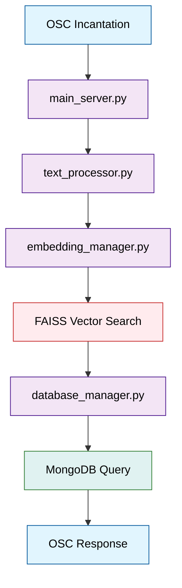
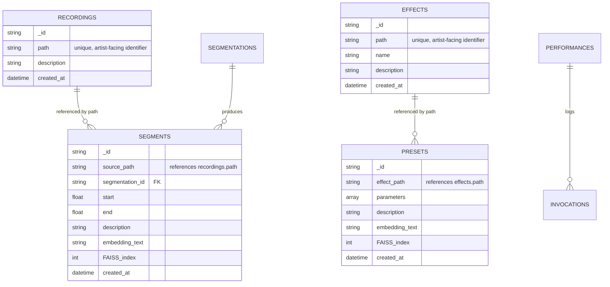
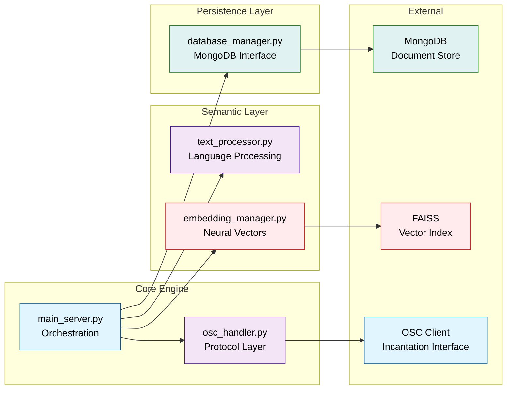
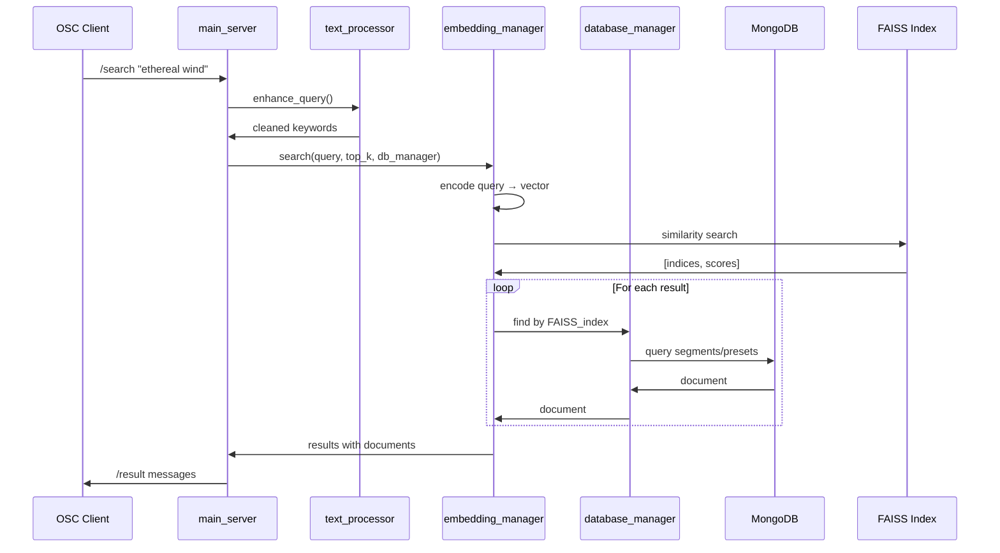

# Hibikidō (響き道)

_Still air awaits. Quivering breath. A sound, not yet._

Hibikidō (響き道) - the way of resonance - is not a search engine. It is a recognition system. Sounds exist in latency, waiting in the digital wind. We do not create them; we help them remember their names.

Cast incantations in natural language. Receive coordinates to the sounds that were always there.

## For Sound Artists

### The Practice

In the old way, Kazukorei (風隠霊) - the hidden wind spirit - was not summoned but allowed. The ritual of Yūonshō (幽音章) recognizes what already exists in the spaces between breaths.

Hibikidō digitizes this recognition. Your sound library becomes a constellation of latent possibilities. Natural language becomes the sigil that opens gates to specific sounds.

### Incantations

Instead of browsing folders or remembering filenames, you speak to the wind:

- _"ethereal forest breathing"_ → atmospheric field recordings
- _"metallic scraping industrial decay"_ → harsh textural sounds
- _"warm analog pulse nostalgic"_ → vintage synthesizer patterns
- _"ritualistic drone low frequency"_ → deep sustained tones

The system understands semantic relationships through neural embeddings. Similar intentions find related sounds even when the exact words differ.

### Communication Protocol

Hibikidō speaks OSC (Open Sound Control). Any OSC client becomes an interface for incantation.

#### Core Invocations

Send to the server (default: `127.0.0.1:9000`):

```
/search "your incantation here"
→ Returns: /result [index, collection, score, document_data...]

/add_recording "sounds/wind/forest_01.wav" '{"description":"morning wind through oak trees"}'
→ Add new recording and auto-create full-length segment (0.0-1.0)

/add_effect "effects/reverb/cathedral.dll" '{"description":"gothic cathedral reverb"}'
→ Add new effect and auto-create default preset

/add_segment "wind gusts" '{"source_path":"sounds/wind/forest_01.wav", "start":0.1, "end":0.6, "segmentation_id":"manual"}'
→ Add new segment with timing and metadata

/add_preset "warm cathedral ambience" '{"effect_path":"effects/reverb/cathedral.dll", "parameters":[0.8, 0.3, 0.9]}'
→ Add new effect preset with parameters

/rebuild_index
→ Regenerate all embeddings from database (use after bulk changes)

/stats
→ Returns: /stats_result [recordings, segments, effects, presets, total_searchable]

/stop
→ Graceful shutdown
```

#### Response Patterns

The server responds on `127.0.0.1:9001`:

**Search Results** (`/result`):

- `index`: Result position
- `collection`: "segments" or "presets"
- `score`: Similarity (0.0-1.0, higher = stronger resonance)
- `path`: File path for the audio/effect
- `description`: Human-readable description from embedding text
- `start`: Start position (0.0-1.0, normalized, 0.0 for presets)
- `end`: End position (0.0-1.0, normalized, 0.0 for presets)
- `parameters`: Effect parameters (presets only, empty array for segments)

**Status Messages**:

- `/confirm "message"` - Acknowledgments
- `/error "message"` - When incantations fail
- `/search_complete count` - End of results

### The Database of Latent Sounds

Hibikidō organizes sound through hierarchical relationships:

- **Recordings**: Source audio files, the raw captured wind
- **Segments**: Timestamped slices within recordings
- **Effects**: Audio processing tools with semantic presets
- **Performances**: Sessions logs of invocations over time

Each segment and effect preset exists as a point in semantic space, findable through language that describes its essence rather than its filename.

---

## For Artist-Programmers

### System Architecture

Hibikidō implements a neural semantic search over a hierarchical audio database. The core loop: natural language → embedding vector → similarity search → MongoDB document retrieval.



### Database Schema

MongoDB collections with semantic indexing:



### Component Architecture



### Data Flow Deep Dive

#### Semantic Processing Pipeline



#### Hierarchical Context Generation

The `text_processor.py` creates embedding text using hierarchical context:

**For Segments**: `segment.description + segmentation.description + recording.description`  
**For Presets**: `preset.description + effect.description`

Priority flows from specific (segment/preset) to general (recording/effect), with word limits ensuring focused embeddings. Target: 15 words, hard limit: 20 words.

**Auto-Creation Features**:

- New recordings automatically get full-length segments (0.0-1.0)
- New effects automatically get default presets with empty parameters
- All items receive immediate FAISS embeddings for searchability
- MongoDB auto-generates unique ObjectIds (no manual ID management)

### Key Components Explained

#### main_server.py - The Orchestrator

Central command that:

- Manages component lifecycle
- Routes OSC messages to handlers
- Coordinates search operations
- Handles graceful shutdown

**Key Methods**:

- `_handle_search()`: Main incantation processor
- `_handle_add_recording()`: Creates new source files with auto-segment
- `_handle_add_effect()`: Creates new effects with default preset
- `_handle_add_segment()`: Creates new timestamped audio slices with normalized timing
- `_handle_add_preset()`: Creates new effect configurations
- `_send_search_results()`: Formats simplified, uniform results for OSC
- `_create_display_description()`: Converts embedding text to human-readable descriptions
- `_register_osc_handlers()`: Maps OSC addresses to methods

#### embedding_manager.py - Neural Recognition

Transforms language into semantic vectors using `sentence-transformers`.

**Configuration**:

- Model: `all-MiniLM-L6-v2` (384-dimensional embeddings)
- Index: FAISS `IndexFlatIP` with cosine similarity
- Storage: Persistent `.index` file with auto-save

**Key Methods**:

- `add_embedding(text)`: Text → normalized vector → FAISS storage
- `search(query, top_k, db_manager)`: Query → similar vectors → MongoDB lookups
- `rebuild_from_database()`: Regenerate entire index from MongoDB with hierarchical context

#### database_manager.py - Hierarchical Storage

MongoDB interface implementing the full schema hierarchy.

**Collections**:

- `recordings`: Source audio files, indexed by path (unique)
- `segments`: Timestamped slices with embeddings, reference recordings by path with normalized 0-1 timing
- `effects`: Processing tools, indexed by path (unique)
- `presets`: Effect configurations with embeddings, reference effects by path (separate collection)
- `performances`: Session logs
- `segmentations`: Batch processing metadata

**Search Integration**:

- `get_segment_by_faiss_id()`: Vector → segment document
- `get_preset_by_faiss_id()`: Vector → preset document
- Path-based lookups for human-readable references
- Maintains FAISS index references in documents
- MongoDB auto-generates unique ObjectIds for all documents

#### text_processor.py - Language Purification

Converts raw descriptions into optimized embedding text.

**Hierarchical Processing**:

```python
# Segment context (15 words max)
segment_text = combine_contexts([
    (segment.description, 10),      # Local context
    (segmentation.description, 5),  # Method context
    (recording.description, 5)      # Source context
])
```

**Enhancement Pipeline**:

1. spaCy processing (if available) or simple tokenization
2. Stop word removal (including audio-specific terms)
3. Lemmatization for semantic consistency
4. Word limit enforcement with priority ordering

#### osc_handler.py - Protocol Layer

OSC communication with message parsing and routing.

**Message Flow**:

```
OSC bytes → parse_args() → dispatcher → handler method → format response → OSC output
```

**Response Formatting**:

- Handles complex data serialization for OSC
- Manages client connection state
- Provides error reporting and status updates

### Development Patterns

#### Adding New Search Types

1. Extend database schema in `database_manager.py`
2. Add embedding generation in `text_processor.py`
3. Update search logic in `embedding_manager.py`
4. Add OSC handlers in `main_server.py`

#### Extending Text Processing

The `TextProcessor` uses hierarchical context generation. To modify:

1. Update `create_segment_embedding_text()` or `create_preset_embedding_text()`
2. Adjust word limits and priority ordering
3. Test with `rebuild_from_database()` to regenerate embeddings

#### Custom OSC Commands

Register new handlers in `main_server._register_osc_handlers()`:

```python
def _handle_custom_command(self, unused_addr: str, *args):
    parsed = self.osc_handler.parse_args(*args)
    # Your logic here
    self.osc_handler.send_confirm("custom response")
```

### Installation & Setup

#### Dependencies

```bash
pip install sentence-transformers python-osc faiss-cpu torch pymongo pandas

# Optional enhanced text processing:
pip install spacy
python -m spacy download en_core_web_sm
```

#### Database Setup

Install and run MongoDB:

```bash
# Default connection: mongodb://localhost:27017
mongod
```

#### Launch Sequence

```bash
python -m hibikido.main_server [--config config.json] [--log-level DEBUG]
```

The server will:

1. Connect to MongoDB and initialize collections
2. Load the sentence transformer model
3. Initialize or load the FAISS index
4. Start OSC server and register handlers
5. Send ready signal via OSC

### Configuration

Override defaults with `config.json`:

```json
{
  "mongodb": {
    "uri": "mongodb://localhost:27017",
    "database": "hibikido"
  },
  "embedding": {
    "model_name": "all-MiniLM-L6-v2",
    "index_file": "hibikido.index"
  },
  "osc": {
    "listen_ip": "127.0.0.1",
    "listen_port": 9000,
    "send_ip": "127.0.0.1",
    "send_port": 9001
  },
  "search": {
    "top_k": 10,
    "min_score": 0.3
  }
}
```

### Performance Characteristics

- **Embedding Generation**: ~10-50ms per text
- **Search Latency**: ~1-15ms depending on index size
- **Memory Usage**: ~100MB base + index size
- **Scalability**: Tested to 100K+ segments/presets
- **Database**: MongoDB with automatic ObjectId generation
- **Timing**: All segments use normalized 0-1 values (duration-agnostic)

### Debugging The Recognition

**Enable verbose logging**:

```bash
python -m hibikido.main_server --log-level DEBUG
```

**Inspect embeddings**: Check the `embedding_text` field in MongoDB documents to understand what the neural network actually sees.

**Monitor vector quality**: Use `/stats` to verify embeddings are being created, and examine FAISS index file size.

**OSC debugging**: Tools like `oscdump` can monitor message traffic.

---

_Each line must be made in one breath, and the full sigil drawn in silence._


